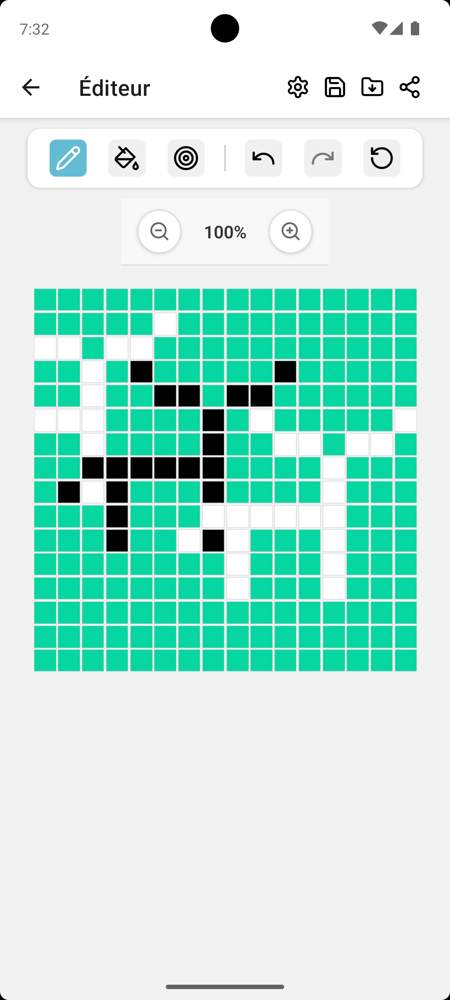

## Pixel Art Editor – Documentation

### Instructions pour exécuter l'application

#### Prérequis

* Node.js >= 16
* npm
* Expo CLI
* iOS Simulator / Android Emulator / Appareil physique

#### Installation

```bash
git clone https://github.com/guisszo/pixel-art-editor.git
cd pixel-art-editor
```

#### Lancement de l'app

```bash
npx expo start
```

Appuyez sur `i` (iOS) ou `a` (Android) pour lancer un simulateur depuis le terminal.

---

### Choix techniques

| Élément               | Choix technique                         | Raison                                                               |
| --------------------- | --------------------------------------- | -------------------------------------------------------------------- |
| Framework mobile      | **React Native (via Expo)**             | Développement cross-platform rapide et flexible                      |
| État global           | **Redux Toolkit**                       | Gestion centralisée du grid, des outils, de l’historique (undo/redo) |
| Interface utilisateur | **React Native + custom styles**  | UI légère, rapide et personnalisable                                 |
| Gestes                | **react-native-gesture-handler**        | Support fiable pour le drag et autres interactions complexes         |
| Capture/partage       | **react-native-view-shot + Share API**  | Pour capturer et partager facilement la création                     |

---

### Structure fonctionnelle

* `PixelGrid` : affiche la grille et les cellules.
* `PixelCell` : une cellule individuelle.
* `ToolBar` : sélection des outils (crayon, remplissage, undo/redo).
* `ColorPalette` : sélection de la couleur active.
* `pixelArtsReducer.ts` : gère les actions Redux comme `fillAllCells`, `undoAction`,`redoAction`, etc.
* `Editor Screen` : Page pour dessiner.
* `Gallery` : Page contenant les arts sauvegardés.

---

### Exemples de créations

| Exemples de pixel art créés dans l'application |
| ---------------------------------------------- |
|   |
|   |
|   |

*Tu peux enregistrer tes créations avec le bouton de partage intégré.*

---
